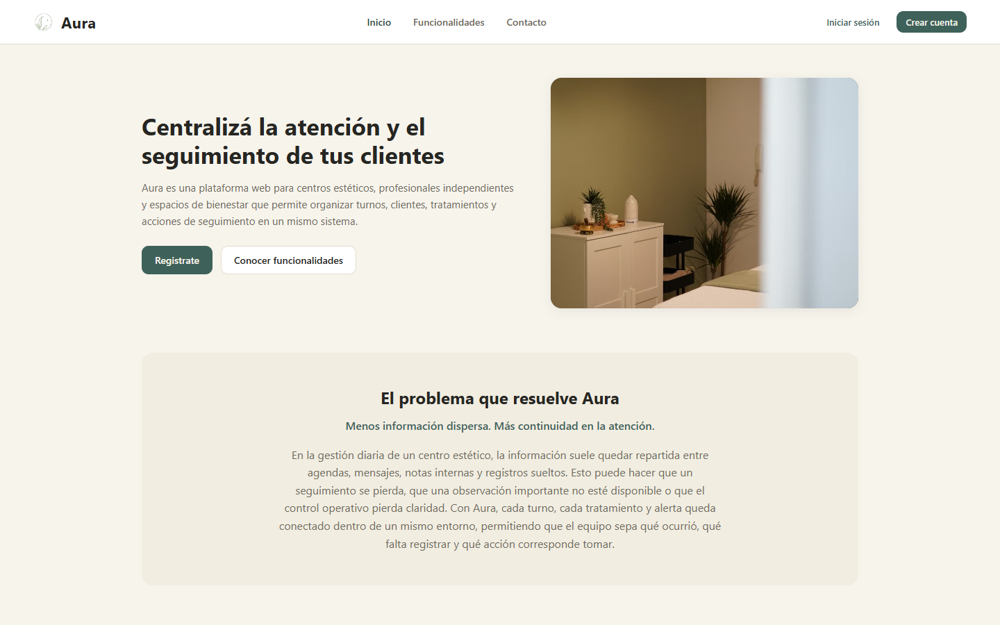
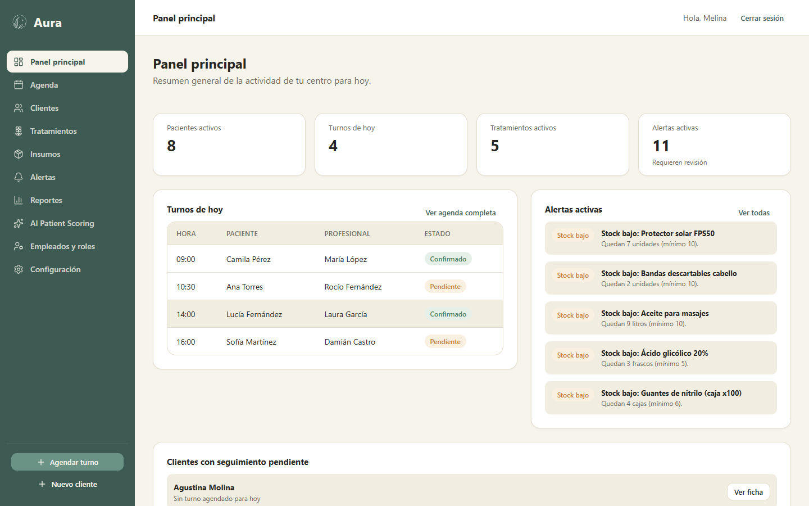
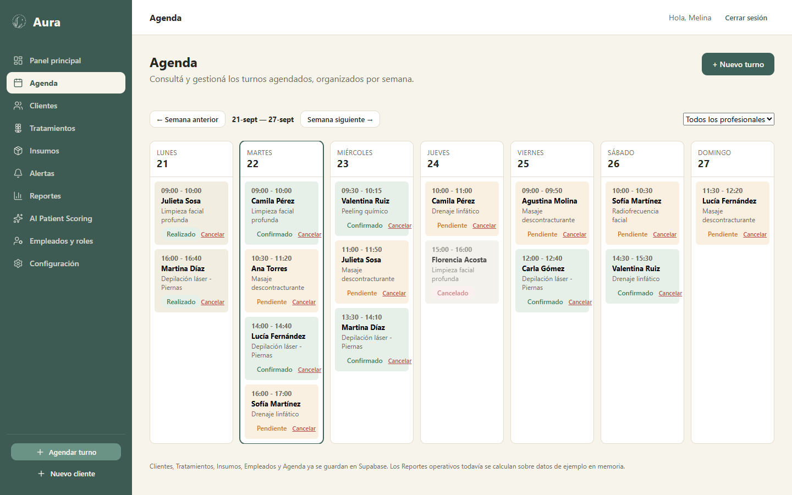
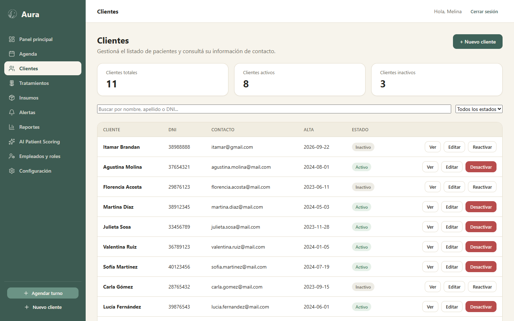
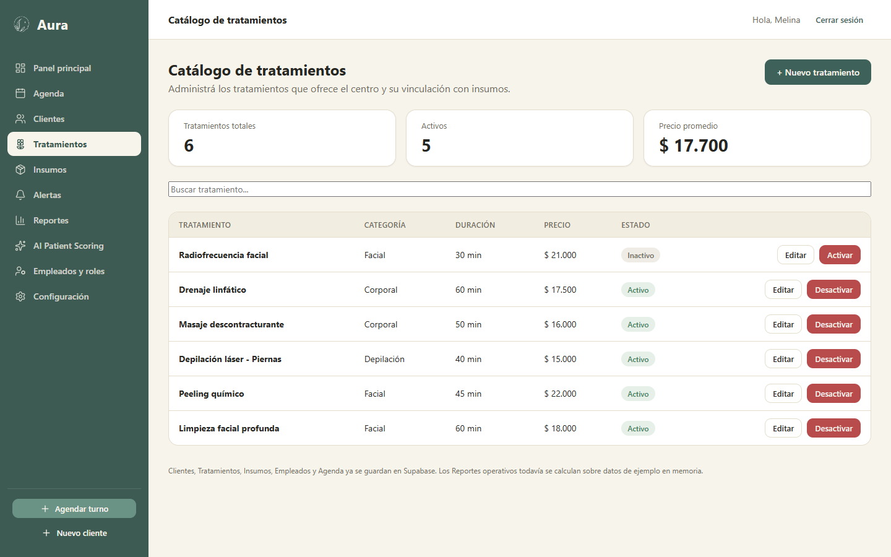
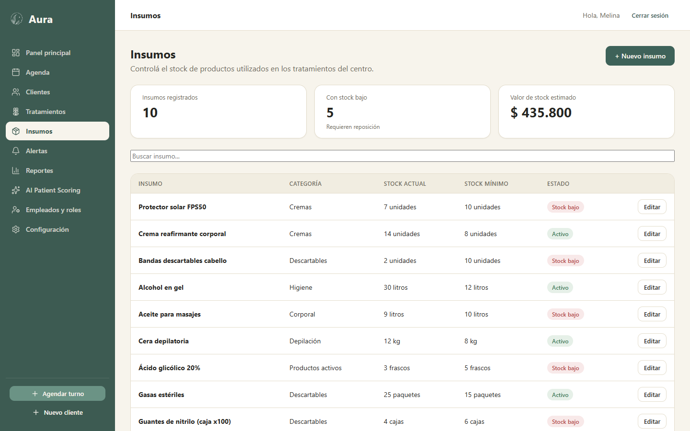

# Aura

**Gestión inteligente para bienestar y estética.**

Trabajo Final de Ingeniería — Universidad Abierta Interamericana.

Aura es una plataforma web para centros estéticos, profesionales independientes y espacios de bienestar. Centraliza la gestión de pacientes, profesionales, tratamientos, turnos e insumos, con alertas automáticas y reportes operativos, todo en un mismo sistema.

## Capturas

| Landing | Panel principal |
|---|---|
|  |  |

| Agenda | Clientes |
|---|---|
|  |  |

| Tratamientos | Insumos |
|---|---|
|  |  |

## Stack tecnológico

- **Frontend**: React + Vite, React Router, SCSS
- **Backend**: [Supabase](https://supabase.com) — Postgres, autenticación y API REST autogenerada, sin servidor propio
- **Íconos**: [lucide-react](https://lucide.dev)

No hay un backend propio corriendo aparte: Supabase cumple ese rol (base de datos, autenticación y API), y React se conecta directo a través de su cliente JS.

## Arquitectura

El proyecto mantiene una separación en capas dentro del propio cliente React, en vez de un servidor .NET/Node aparte:

```
Presentación (pages/ y components/)
        ↓
BLL — src/bll/*.js         (reglas de negocio: validaciones, superposición de turnos, cálculo de alertas)
        ↓
Mappers — src/mappers/*.js (traducen filas de la base a objetos de la app y viceversa)
        ↓
DAL — src/dal/*.js         (consultas puras a Supabase, sin lógica de negocio)
        ↓
Supabase (Postgres + Auth)
```

Cada módulo (pacientes, tratamientos, insumos, turnos, etc.) tiene su propio archivo en cada capa, con el mismo nombre de funciones en todas partes — así ninguna pantalla necesita cambiar si el día de mañana cambia cómo se accede a los datos.

## Estructura del proyecto

```
Aura/
├─ src/
│  ├─ pages/        → una carpeta por módulo (patients, treatments, supplies, schedule, ...)
│  ├─ components/   → piezas reutilizables (Sidebar, Topbar, Modal, Badge, Logo, ...)
│  ├─ layouts/       → PublicLayout (sitio público) y AppLayout (panel interno)
│  ├─ context/       → AuthContext (sesión real de Supabase Auth)
│  ├─ bll/           → lógica de negocio (una capa por entidad)
│  ├─ mappers/       → traducción de datos entre la base y la app
│  ├─ dal/           → acceso a datos (consultas a Supabase)
│  ├─ mocks/         → datos de ejemplo originales (semilla de referencia)
│  └─ styles/        → variables y estilos base compartidos
├─ supabase/         → scripts SQL: esquema, políticas de seguridad y datos de ejemplo
├─ public/           → assets estáticos (logo, etc.)
└─ docs/screenshots/ → capturas usadas en este README
```

## Cómo levantarlo en otra PC

Como la base de datos vive en la nube (Supabase), no hace falta instalar ningún motor de base de datos local — solo Node.js y conexión a internet.

1. Cloná el repositorio:
   ```bash
   git clone https://github.com/melinatabor/Aura.git
   cd Aura
   ```
2. Creá un archivo `.env` en la raíz (no viaja en el repositorio, por seguridad) con las credenciales del proyecto de Supabase:
   ```
   VITE_SUPABASE_URL=https://xxxxxxxx.supabase.co
   VITE_SUPABASE_PUBLISHABLE_KEY=sb_publishable_xxxxxxxx
   ```
   Se consiguen en el dashboard de Supabase, en **Project Settings → API**. Si es la primera vez que se arma el proyecto, primero hay que correr los scripts de `supabase/` (en orden: `schema.sql`, `grants.sql`, `seed.sql`, y el resto) desde el **SQL Editor** de Supabase.
3. Instalá las dependencias y corré el proyecto:
   ```bash
   npm install
   npm run dev
   ```
4. Abrí la URL que muestre la consola (por defecto `http://localhost:5173`).

## Módulos

**Sitio público**: Home, Funcionalidades, Contacto (guarda la consulta en la base), Iniciar sesión, Crear cuenta.

**Panel interno (Aura Pro)**: Panel principal, Agenda (vista semanal con validación de superposición de horarios), Clientes, Tratamientos (con insumos vinculados), Insumos (con alerta de stock bajo), Alertas, Reportes operativos, AI Patient Scoring (maqueta visual, sin IA real), Empleados y roles, Configuración operativa.

## Estado del proyecto

El desarrollo avanza semana a semana según un plan de trabajo documentado aparte. A grandes rasgos: el frontend, la autenticación real, y los módulos de Clientes, Profesionales, Tratamientos, Insumos y Agenda ya están conectados de punta a punta a Supabase. Quedan pendientes un sistema de roles y permisos más granular, la persistencia de alertas/reportes/recordatorios, y pruebas de instalación en un equipo distinto al de desarrollo.

## Autora

Melina Aldana Tabor — Ingeniería en Sistemas, UAI.
